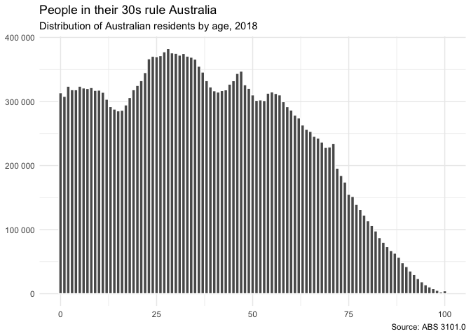

<!-- README.md is generated from README.Rmd. Please edit that file -->
readabs
=======

Downloads, imports, and tidies time series data from the Australian Bureau of Statistics.

**readabs is changing. The package has been merged with [getabs](https://github.com/mattcowgill/getabs) and readabs has gained new functionality. Old readabs functions still work, but read\_abs\_data() is soft-deprecated.**

We'd welcome Github issues containing error reports or feature requests. Alternatively you can email the package maintainer at mattcowgill at gmail dot com.

Website
-------

The `readabs` website can be viewed at <https://github.com/mattcowgill/readabs>

Setup
-----

You can install the developer version of **readabs** from GitHub with:

``` r
# if you don't have devtools installed, first run:
# install.packages("devtools")

devtools::install_github("mattcowgill/readabs", ref = "dev")
```

Load the package as you would with any R package:

``` r
library(readabs)
```

Usage
-----

There are two key functions in **readabs**. They are:

-   `read_abs()` downloads, imports, and tidies time series data from the ABS website.
-   `read_abs_local()` imports and tidies time series data from ABS spreadsheets stored locally.

Both functions return a single tidy data frame (tibble) containing long data, including metadata.

If the data you are interested in is available on [ABS.Stat](http://stat.data.abs.gov.au), you may wish to use the following:

-   `read_abs_sdmx()` uses the ABS.Stat API to download from ABS.Stat.

Example
-------

Get all tables from the latest release of ABS 3101.0 (Australian Demographic Statistics) and create a dataframe called `demog` containing all the data from this catalogue number.[1]

``` r
demog <- read_abs("3101.0")
#> Finding filenames for tables from ABS catalogue 3101.0
#> Attempting to download files from cat. no. 3101.0, Australian Demographic Statistics
#> Extracting data from downloaded spreadsheets
#> Tidying data from imported ABS spreadsheets
```

Now you can use your downloaded and tidied data to make a graph. You'll first need to filter the data frame so it only contains the series of interest. The `series` column reflects the series names in the first row of ABS time series; these can be long and unwieldy.

``` r
library(tidyverse)
#> ── Attaching packages ───────────────────────────────────────────────────────────── tidyverse 1.2.1 ──
#> ✔ ggplot2 3.1.0.9000     ✔ purrr   0.2.5     
#> ✔ tibble  2.0.0.9000     ✔ dplyr   0.7.8     
#> ✔ tidyr   0.8.2          ✔ stringr 1.3.1     
#> ✔ readr   1.3.1          ✔ forcats 0.3.0
#> ── Conflicts ──────────────────────────────────────────────────────────────── tidyverse_conflicts() ──
#> ✖ dplyr::filter() masks stats::filter()
#> ✖ dplyr::lag()    masks stats::lag()

demog %>%
  filter(series == "Estimated Resident Population (ERP) ;  Australia ;") %>%
  ggplot(aes(x = date, y = value)) +
  geom_line() +
  theme_minimal() +
  labs(title = "There's more of us than there used to be",
       subtitle = "Estimated resident population of Australia over time (thousands)",
       caption = "Source: ABS 3101.0") +
  theme(axis.title = element_blank() )
```


Note that different time series can share the same series name, as reflected in the `series` column of your data frame. For example, there are multiple series named "Estimated Resident Population ; Persons ;". Some of these series refer to the whole country; some refer to individual states. In this particular dataset, the ABS splits states and national totals into different tables, with identically-named columns.

You can filter by `table_no` as well as `series` to ensure you get the series you want. Here's one way you could filter the data to give you the distribution of the national population by age as at the latest data collection, and then graph it.[2]

``` r
age_distrib <- demog %>%
  filter(grepl("Estimated Resident Population ;  Persons ;", series),
         # In this case we only want to retain rows where the series contains a digit
         str_detect(series, "\\d"),
         # We only want the latest date
         date == max(date),
         # We only want data from table 59, which refers to the whole country
         table_no == "3101059") %>% 
  mutate(age = parse_number(series)) 

age_distrib %>% ggplot(aes(x = age, y = value)) +
  geom_col(col = "white") +
  theme_minimal() +
  scale_y_continuous(labels = scales::number) +
  labs(title = "People in their 30s rule Australia",
       subtitle = paste0("Distribution of Australian residents by age, ",
                         lubridate::year(age_distrib$date[1])),
       caption = "Source: ABS 3101.0") +
  theme(axis.title = element_blank() )
```



Another way to filter your data is by using the unique ABS time series identifier. Every ABS time series has one; it's in the tenth row of any spreadsheet containing ABS time series and looks something like "A2158920J". The time series identifier is stored in the `series_id` column of your data frame.

To graph time series "A2158920J", which is the estimated population of 0 year old males in Australia, you can just filter your data frame like this:

``` r
demog %>%
  filter(series_id == "A2158920J") %>%
  ggplot(aes(x = date, y = value)) +
  geom_line() +
  theme_minimal() +
  labs(title = "Hello little babies!",
       subtitle = "Estimated resident population of 0 year old males over time",
       caption = "Source: ABS 3101.0") +
    theme(axis.title = element_blank() )
```


[1] Note that running `read_abs()` will save ABS time series spreadsheets to your disk; by default these go in a data/ABS subdirectory of your working directory. Modify this using the path argument of `read_abs()`.

[2] Future versions of the package will have the table titles as another column in your data frame, which will make this filtering process easier and require less frequent reference to the spreadsheets or ABS website.
