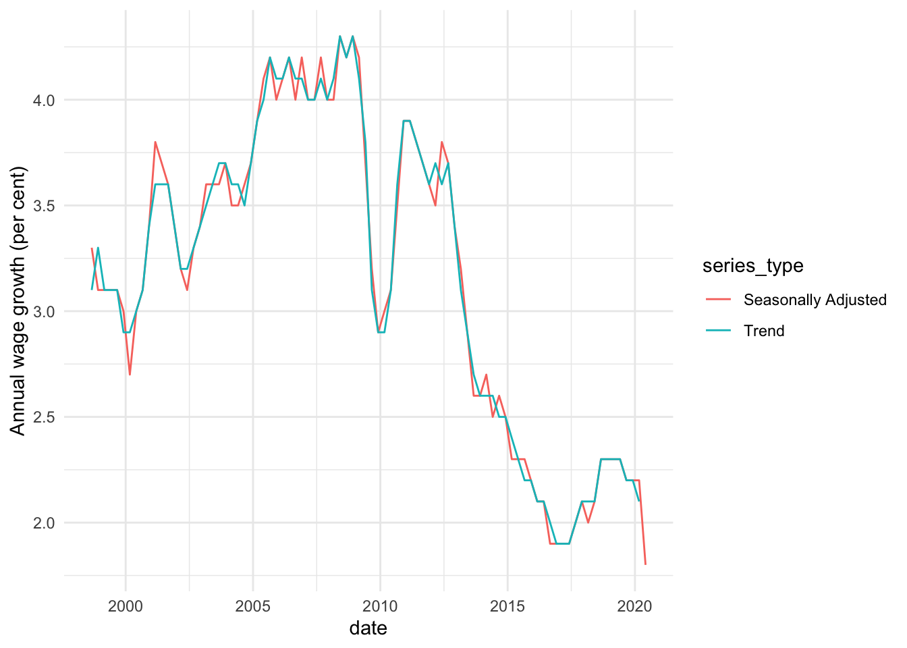

<!-- README.md is generated from README.Rmd. Please edit that file -->

# readabs

<!-- badges: start -->

[](https://travis-ci.org/MattCowgill/readabs)
[](https://codecov.io/gh/MattCowgill/readabs)
[](https://www.repostatus.org/#active)
[](https://cran.r-project.org/package=readabs)
[](https://github.com/mattcowgill/readabs/actions)
<!-- badges: end -->

## Overview

{readabs} helps you easily download, import, and tidy time series data
from the Australian Bureau of Statistics within R. This saves you time
manually downloading and tediously tidying time series data and allows
you to spend more time on your analysis.

Github issues containing error reports or feature requests are welcome.
Alternatively you can email the package maintainer at mattcowgill at
gmail dot com.

## Installation

Install the latest CRAN version of {readabs} with:

``` r
install.packages("readabs")
```

You can install the developer version of {readabs} from GitHub with:

``` r
# if you don't have devtools installed, first run:
# install.packages("devtools")
devtools::install_github("mattcowgill/readabs")
```

## Usage

There is one key function in {readabs}. It is `read_abs()`, which
downloads, imports, and tidies time series data from the ABS website.

There are some other functions you may find useful.

  - `read_abs_local()` imports and tidies time series data from ABS
    spreadsheets stored on a local drive.
  - `separate_series()` splits the `series` column of a tidied ABS time
    series spreadsheet into multiple columns, reducing the manual
    wrangling that’s needed to work with the data.

Both `read_abs()` and `read_abs_local()` return a single tidy data frame
(tibble).

## Examples

To download all the time series data from an ABS catalogue number to
your disk, and import the data to R as a single tidy data frame, use
`read_abs()`.

First we’ll load {readabs} and the {tidyverse}:

``` r
library(readabs)
#> Environment variable 'R_READABS_PATH' is unset. Downloaded files will be saved in a temporary directory.
#> You can set 'R_READABS_PATH' at any time. To set it for the rest of this session, use
#>  Sys.setenv(R_READABS_PATH = <path>)
library(tidyverse)
#> ── Attaching packages ──────────────────────────────────────────────────────────────────── tidyverse 1.3.0.9000 ──
#> ✓ ggplot2 3.3.2          ✓ purrr   0.3.4.9000
#> ✓ tibble  3.0.3.9000     ✓ dplyr   1.0.1     
#> ✓ tidyr   1.1.0          ✓ stringr 1.4.0.9000
#> ✓ readr   1.3.1          ✓ forcats 0.5.0.9000
#> ── Conflicts ──────────────────────────────────────────────────────────────────────────── tidyverse_conflicts() ──
#> x dplyr::filter() masks stats::filter()
#> x dplyr::lag()    masks stats::lag()
```

Now we’ll create one data frame that contains all the time series data
from the Wage Price Index, catalogue number 6345.0:

``` r
all_wpi <- read_abs("6345.0")
#> Finding filenames for tables corresponding to ABS catalogue 6345.0
#> Attempting to download files from catalogue 6345.0, Wage Price Index, Australia
#> Extracting data from downloaded spreadsheets
#> Tidying data from imported ABS spreadsheets
```

This is what it looks like:

``` r
str(all_wpi)
#> tibble [58,834 × 12] (S3: tbl_df/tbl/data.frame)
#>  $ table_no        : chr [1:58834] "634501" "634501" "634501" "634501" ...
#>  $ sheet_no        : chr [1:58834] "Data1" "Data1" "Data1" "Data1" ...
#>  $ table_title     : chr [1:58834] "Table 1. Total Hourly Rates of Pay Excluding Bonuses: Sector, Original, Seasonally Adjusted and Trend" "Table 1. Total Hourly Rates of Pay Excluding Bonuses: Sector, Original, Seasonally Adjusted and Trend" "Table 1. Total Hourly Rates of Pay Excluding Bonuses: Sector, Original, Seasonally Adjusted and Trend" "Table 1. Total Hourly Rates of Pay Excluding Bonuses: Sector, Original, Seasonally Adjusted and Trend" ...
#>  $ date            : Date[1:58834], format: "1997-09-01" "1997-12-01" ...
#>  $ series          : chr [1:58834] "Quarterly Index ;  Total hourly rates of pay excluding bonuses ;  Australia ;  Private ;  All industries ;" "Quarterly Index ;  Total hourly rates of pay excluding bonuses ;  Australia ;  Private ;  All industries ;" "Quarterly Index ;  Total hourly rates of pay excluding bonuses ;  Australia ;  Private ;  All industries ;" "Quarterly Index ;  Total hourly rates of pay excluding bonuses ;  Australia ;  Private ;  All industries ;" ...
#>  $ value           : num [1:58834] 67.4 67.9 68.5 68.8 69.6 70 70.4 70.8 71.5 71.9 ...
#>  $ series_type     : chr [1:58834] "Original" "Original" "Original" "Original" ...
#>  $ data_type       : chr [1:58834] "INDEX" "INDEX" "INDEX" "INDEX" ...
#>  $ collection_month: chr [1:58834] "3" "3" "3" "3" ...
#>  $ frequency       : chr [1:58834] "Quarter" "Quarter" "Quarter" "Quarter" ...
#>  $ series_id       : chr [1:58834] "A2603039T" "A2603039T" "A2603039T" "A2603039T" ...
#>  $ unit            : chr [1:58834] "Index Numbers" "Index Numbers" "Index Numbers" "Index Numbers" ...
```

It only takes you a few lines of code to make a graph from your data:

``` r
all_wpi %>%
  filter(series == "Percentage Change From Corresponding Quarter of Previous Year ;  Australia ;  Total hourly rates of pay excluding bonuses ;  Private and Public ;  All industries ;",
         !is.na(value)) %>%
  ggplot(aes(x = date, y = value, col = series_type)) +
  geom_line() +
  theme_minimal() +
  labs(y = "Annual wage growth (per cent)")
```

<!-- -->

In the example above we downloaded all the time series from a catalogue
number. This will often be overkill. If you know the data you need is in
a particular table, you can just get that table like this:

``` r
wpi_t1 <- read_abs("6345.0", tables = 1)
#> Warning in read_abs("6345.0", tables = 1): `tables` was providedyet `check_local
#> = TRUE` and fst files are available so `tables` will be ignored.
```

If you want multiple tables, but not the whole catalogue, that’s easy
too:

``` r
wpi_t1_t5 <- read_abs("6345.0", tables = c("1", "5a"))
#> Warning in read_abs("6345.0", tables = c("1", "5a")): `tables` was providedyet
#> `check_local = TRUE` and fst files are available so `tables` will be ignored.
```

In most cases, the `series` column will contain multiple components,
separated by ‘;’. The `separate_series()` function can help wrangling
this column.

For more examples, please see the readabs vignette (run
`browseVignettes("readabs")`).

## New in recent versions

In 0.4.3,

  - `read_abs()` checks to see if you are connected to the internet, and
    can connect to the ABS website, before trying to download data. The
    method used for checking connectivity has been improved, to make the
    function compatible with a broader range of IT environments. Thanks
    to Oscar Lane for noticing the issue and proposing a fix.

In 0.4.2,

  - The default path for files downloaded by `read_abs()` is now set by
    an environment variable, rather than defaulting to ‘data/ABS’. If
    the variable is not set, downloaded files will be stored in a
    temporary directory. Thanks to Hugh Parsonage for the idea and
    implementation. See `?read_abs` for more information.

In 0.4.1,

  - The `separate_series()` function gained a `remove_nas` argument -
    thanks to Sam Gow for the suggestion. This makes tidying data
    easier.
  - Various minor improvements and bug fixes.

In 0.4.0,

  - A new `separate_series()` function was added, to be used in
    conjunction with `read_abs()` to help tidy data (thanks to David
    Diviny).
  - A new `read_cpi()` convenience function was added; it returns a
    tibble containing dates and CPI index numbers.
  - The `read_abs()` function now has an optional `series_id` argument,
    allowing users to get individual time series by using the unique
    identifiers given to them by the ABS.
  - The `read_abs()` function now has a `retain_files` argument (`TRUE`
    by default); by setting this to `FALSE`, downloaded spreadsheets
    will be stored in a temporary directory
  - Some minor bug fixes and enhances - see NEWS for details.

## Awesome Official Statistics Software

[](https://github.com/SNStatComp/awesome-official-statistics-software)

We’re pleased to be included in a [list of
software](https://github.com/SNStatComp/awesome-official-statistics-software)
that can be used to work with official statistics.

## Package history

From version 0.3.0, `readabs` gained significant new functionality and
the package changed substantially. Pre-0.3.0 functions still work, but
`read_abs_data()` is deprecated. The behaviour of `read_abs_metadata()`
has changed and the function is deprecated. The old version of `readabs`
is available in the [0.2.9 branch on
Github](https://github.com/MattCowgill/readabs/tree/0.2.9).
