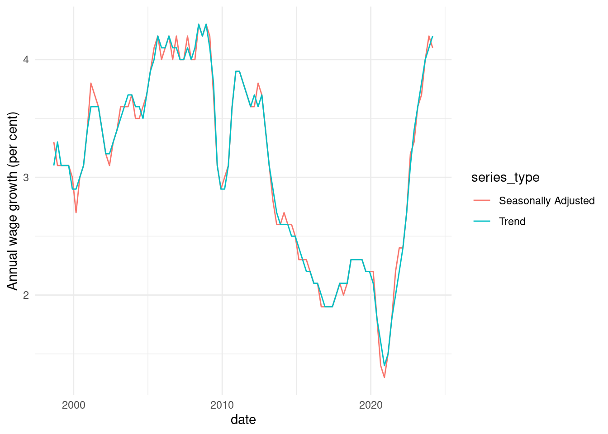

<!-- README.md is generated from README.Rmd. Please edit that file -->

# readabs 

<!-- badges: start -->

[](https://travis-ci.org/MattCowgill/readabs)
[](https://codecov.io/gh/MattCowgill/readabs)
[](https://cran.r-project.org/package=readabs)
[](https://github.com/mattcowgill/readabs/actions)
[](https://www.tidyverse.org/lifecycle/#stable)
<!-- badges: end -->

## Overview

{readabs} helps you easily download, import, and tidy data from the
Australian Bureau of Statistics within R. This saves you time manually
downloading and tediously tidying data and allows you to spend more time
on your analysis.

## Installation

Install the latest CRAN version of {readabs} with:

``` r
install.packages("readabs")
```

You can install the development version of {readabs} from GitHub with:

``` r
# if you don't have devtools installed, first run:
# install.packages("devtools")
devtools::install_github("mattcowgill/readabs")
```

## Usage

The main function in {readabs} is `read_abs()`, which downloads,
imports, and tidies time series data from the ABS website.

There are some other functions you may find useful.

  - `read_abs_local()` imports and tidies time series data from ABS
    spreadsheets stored on a local drive. Thanks to Hugh Parsonage for
    contributing to this functionality.
  - `separate_series()` splits the `series` column of a tidied ABS time
    series spreadsheet into multiple columns, reducing the manual
    wrangling that’s needed to work with the data. Thanks to David
    Diviny for writing this function.
  - `download_abs_data_cube()` downloads a data cube (ie. non-time
    series spreadsheet) from the ABS website. Thanks to David Diviny for
    writing this function.
  - `read_cpi()` imports the Consumer Price Index numbers as a
    two-column tibble: `date` and `cpi`. This is useful for joining to
    other series to adjust data for changes in consumer prices.
  - `read_payrolls()` downloads, imports, and tidies tables from the ABS
    Weekly Payroll Jobs dataset.

## Using read\_abs()

To download all the time series data from an ABS catalogue number to
your disk, and import the data to R as a single tidy data frame, use
`read_abs()`.

First we’ll load {readabs} and the {tidyverse}:

``` r
library(readabs)
#> Environment variable 'R_READABS_PATH' is unset. Downloaded files will be saved in a temporary directory.
#> You can set 'R_READABS_PATH' at any time. To set it for the rest of this session, use
#>  Sys.setenv(R_READABS_PATH = <path>)
library(tidyverse)
#> ── Attaching packages ─────────────────────────────────────── tidyverse 1.3.0 ──
#> ✓ ggplot2 3.3.2          ✓ purrr   0.3.4.9000
#> ✓ tibble  3.0.4          ✓ dplyr   1.0.2     
#> ✓ tidyr   1.1.2          ✓ stringr 1.4.0.9000
#> ✓ readr   1.4.0.9000     ✓ forcats 0.5.0.9000
#> ── Conflicts ────────────────────────────────────────── tidyverse_conflicts() ──
#> x dplyr::filter() masks stats::filter()
#> x dplyr::lag()    masks stats::lag()
```

Now we’ll create one data frame that contains all the time series data
from the Wage Price Index, catalogue number 6345.0:

``` r
all_wpi <- read_abs("6345.0")
#> Finding filenames for tables corresponding to ABS catalogue 6345.0
#> Attempting to download files from catalogue 6345.0, Wage Price Index, Australia
#> Extracting data from downloaded spreadsheets
#> Tidying data from imported ABS spreadsheets
```

This is what it looks like:

``` r
str(all_wpi)
#> tibble [58,834 × 12] (S3: tbl_df/tbl/data.frame)
#>  $ table_no        : chr [1:58834] "634501" "634501" "634501" "634501" ...
#>  $ sheet_no        : chr [1:58834] "Data1" "Data1" "Data1" "Data1" ...
#>  $ table_title     : chr [1:58834] "Table 1. Total Hourly Rates of Pay Excluding Bonuses: Sector, Original, Seasonally Adjusted and Trend" "Table 1. Total Hourly Rates of Pay Excluding Bonuses: Sector, Original, Seasonally Adjusted and Trend" "Table 1. Total Hourly Rates of Pay Excluding Bonuses: Sector, Original, Seasonally Adjusted and Trend" "Table 1. Total Hourly Rates of Pay Excluding Bonuses: Sector, Original, Seasonally Adjusted and Trend" ...
#>  $ date            : Date[1:58834], format: "1997-09-01" "1997-09-01" ...
#>  $ series          : chr [1:58834] "Quarterly Index ;  Total hourly rates of pay excluding bonuses ;  Australia ;  Private ;  All industries ;" "Quarterly Index ;  Total hourly rates of pay excluding bonuses ;  Australia ;  Public ;  All industries ;" "Quarterly Index ;  Total hourly rates of pay excluding bonuses ;  Australia ;  Private and Public ;  All industries ;" "Quarterly Index ;  Total hourly rates of pay excluding bonuses ;  Australia ;  Private ;  All industries ;" ...
#>  $ value           : num [1:58834] 67.4 64.7 66.7 67.3 64.8 66.6 67.3 64.8 66.7 NA ...
#>  $ series_type     : chr [1:58834] "Original" "Original" "Original" "Seasonally Adjusted" ...
#>  $ data_type       : chr [1:58834] "INDEX" "INDEX" "INDEX" "INDEX" ...
#>  $ collection_month: chr [1:58834] "3" "3" "3" "3" ...
#>  $ frequency       : chr [1:58834] "Quarter" "Quarter" "Quarter" "Quarter" ...
#>  $ series_id       : chr [1:58834] "A2603039T" "A2603989W" "A2603609J" "A2713846W" ...
#>  $ unit            : chr [1:58834] "Index Numbers" "Index Numbers" "Index Numbers" "Index Numbers" ...
```

It only takes you a few lines of code to make a graph from your data:

``` r
all_wpi %>%
  filter(series == "Percentage Change From Corresponding Quarter of Previous Year ;  Australia ;  Total hourly rates of pay excluding bonuses ;  Private and Public ;  All industries ;",
         !is.na(value)) %>%
  ggplot(aes(x = date, y = value, col = series_type)) +
  geom_line() +
  theme_minimal() +
  labs(y = "Annual wage growth (per cent)")
```



In the example above we downloaded all the time series from a catalogue
number. This will often be overkill. If you know the data you need is in
a particular table, you can just get that table like this:

``` r
wpi_t1 <- read_abs("6345.0", tables = 1)
#> Warning in read_abs("6345.0", tables = 1): `tables` was providedyet `check_local
#> = TRUE` and fst files are available so `tables` will be ignored.
```

If you want multiple tables, but not the whole catalogue, that’s easy
too:

``` r
wpi_t1_t5 <- read_abs("6345.0", tables = c("1", "5a"))
#> Warning in read_abs("6345.0", tables = c("1", "5a")): `tables` was providedyet
#> `check_local = TRUE` and fst files are available so `tables` will be ignored.
```

In most cases, the `series` column will contain multiple components,
separated by ‘;’. The `separate_series()` function can help wrangling
this column.

For more examples, please see the readabs vignette (run
`browseVignettes("readabs")`).

## Bug reports and feedback

GitHub issues containing error reports or feature requests are welcome.
Alternatively you can email the package maintainer at mattcowgill at
gmail dot com.

## Disclaimer

The {readabs} package is not associated with the Australian Bureau of
Statistics. All data is provided subject to any restrictions and
licensing arrangements noted on the ABS website.

## Awesome Official Statistics Software

[](https://github.com/SNStatComp/awesome-official-statistics-software)

We’re pleased to be included in a [list of
software](https://github.com/SNStatComp/awesome-official-statistics-software)
that can be used to work with official statistics.
