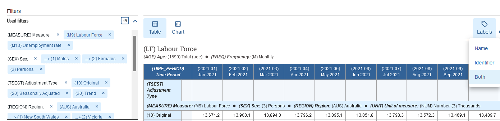
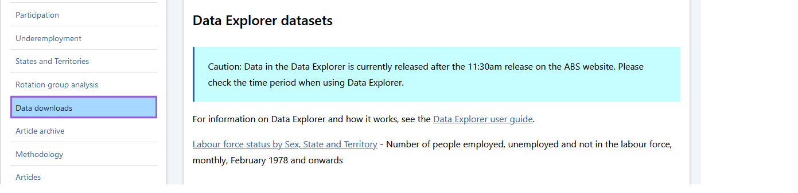
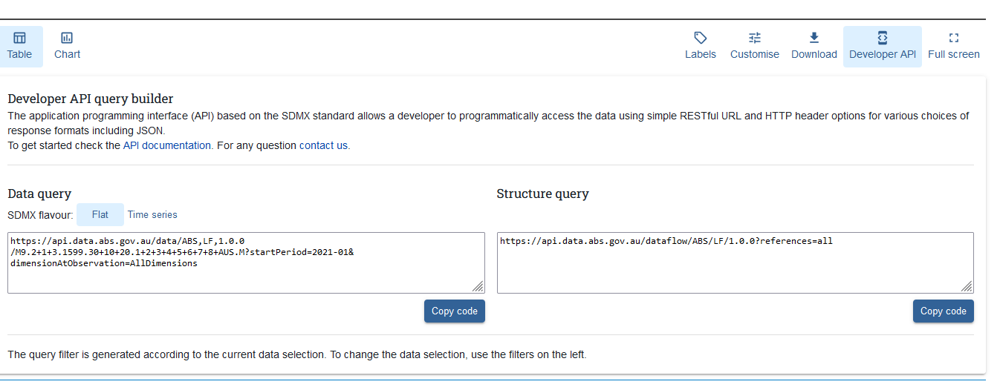
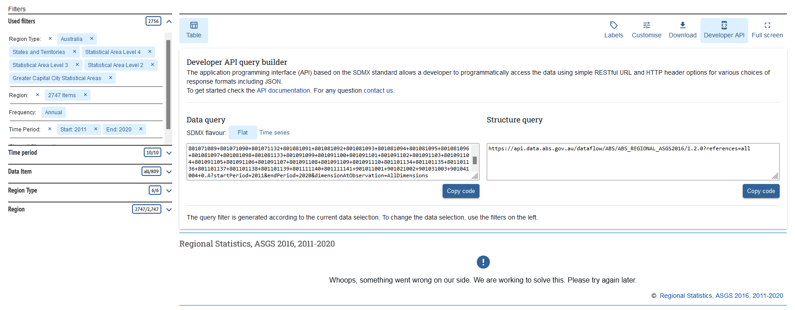

```{r, include = FALSE}
library(knitr)
knitr::opts_chunk$set(
  collapse = TRUE,
  comment = "#>",
  fig.path = "VIGNETTE-"
)
```

```{r setup, echo=FALSE}
library(readabs)
```

# Using the ABS API

Quering data through the ABS API is a mixed experience. On the one hand, not all data is available via the API, it's often released a day or so after the rest of the website is updated, and the URLs are often incomprehensible or too long to be read into R or even queried. However, if you can push through these challenges, you can get pretty tidy data programmatically and repeatedly.

This vignette shows two examples of how to query the API: a best-case scenario using labour force data, and a more complicated example getting the "Data by Region" for the past decade.

Note the API is now called 'Data Explorer'. It was once called 'ABS.stat'.

## Anatomy of a query URL

It's worth briefly introducing the URLs used to query the API. Behold exhibit A, a query URL used to query labour force data:

```
https://api.data.abs.gov.au/data/ABS,LF,1.0.0/M4+M9.2+1+3.1599.30+10+20.1+2+3+4+5+6+7+8+AUS.M?startPeriod=2021-01&dimensionAtObservation=AllDimensions
```

The part in particular that I want to highlight is the `M4+M9.2+1+3.1599.30+10+20.1+2+3+4+5+6+7+8+AUS.M` bit. This component specifies what data are requested, and it's not immediately obvious how, so it's worth breaking it down a little bit.

The first thing to note is that it is dot-separated. Each dot-separated element (i.e. `M4+M9`, `2+1+3`, `1599`, etc) refers to specific levels of a different dimension (where a dimension is something like age, region, measure, etc.). Within each dot-separated element, levels of a dimension are plus-separated (i.e. `M4+M9` is `M4` and `M9`; `2+1+3` is `2`, `1` and `3`). These refer to the codes used by the ABS to encode values of a dimension. For example, `2+1+3` refers to the sex dimension, and `2` means "Females", `1` is Males", and `3` means "Persons", so this URL requests data broken down by females, males and persons. `M4+M9` refer to "Unemployed - looking for full-time work" and "Labour force" respectively. The `1+2+3+4+5+6+7+8+AUS` is states and Australia. Two consequecutive dots means to request all levels of whatever dimension the API expects in that position of the URL.

You might be wondering how to map these codes to what they refer. As far as I know, there isn't a simple way, however, on the Data Explorer page, you can change the "Labels" setting to show "Both" (i.e. codes and names). If you then explore the filters on the left of the page, you may be able to intuit how to construct the URL you need.

```{r out.width = "100%", echo = FALSE}

```

The other element of the URL worth mentioning is `startPeriod=2021-01`. This element is often paired with an `endPeriod=` (separated by an ampersand (`&`)).These values seem to be able to take years or year-month combinations. Leaving the `endPeriod` out of the URL means it will query the most recent data available.

Because of this verbose nature of the query, the URLs can often get quite long (especially when requesting data at granular geographies). This can cause problems for a variety of reasons, which are explored in the section about Data by Region.

## Labour Force

Our goal is to get headline labour force statistics from the API, by state and sex.

### Getting the URL to query

ABS API URLs are very difficult to intuit, so we need to go to their website to know URL to query. We start by going the Labour Force Survey homepage, to the ['Data downloads' section](https://www.abs.gov.au/statistics/labour/employment-and-unemployment/labour-force-australia/latest-release#data-downloads), and scroll down to the 'Data Explorer datasets' subheading.

```{r out.width = "100%", echo = FALSE}

```

We click on the link that says ['Labour force status by Sex, State and Territory'](https://explore.data.abs.gov.au/vis?tm=labour%20force&pg=0&df[ds]=ABS_ABS_TOPICS&df[id]=LF&df[ag]=ABS&df[vs]=1.0.0&hc[Measure]=Labour%20Force&hc[ABS%20Topics]=LABOUR&pd=2021-01%2C&dq=M9.3.1599.30%2B10%2B20.AUS.M&ly[cl]=TIME_PERIOD&ly[rw]=TSEST) which takes us to Data Explorer.

### Tweaking the query

Data Explorer is where we select the fields we want to query. These are displayed as filters on the left of the screen. Each time we change a filter the data preview will update, which can get quite slow. For the purposes of this example we need to get data by state and sex. Note that each time you change a filter, the data preview will update automatically. This can get slow and break the page, so keep that in mind.

Let's make some changes to query the data we need. Let's change:

- Sex: let's select all sexes too (Persons, Males and Females).
- Region: again, let's select all regions (Australia plus the states and territories)

After selecting these filters and letting the preview update, we are ready to get the query URL and read the data into R.

### Getting the API and reading the data

To get the query URL, click on the "Developer API" button. The website provides some info about the API (the link the documentation was broken when I wrote this), and two URLs: a data query and a structure query. The data query URL is the important one. You may note it has two "SDMX Flavours", "Flat" and "Time series": I haven't been able to identify any difference in what is returned, so pick your favourite (most testing has been done with the "Flat" option). Copy the URL, and let's read the data into R.

```{r out.width = "100%", echo = FALSE}

```

```{r out.width = "100%", echo = FALSE}
qu <- "https://api.data.abs.gov.au/data/ABS,LF,1.0.0/M9.2+1+3.1599.30+10+20.1+2+3+4+5+6+7+8+AUS.M?startPeriod=2021-01&dimensionAtObservation=AllDimensions"

lf <- read_abs_api(query_url = qu)
# Let's take a look
head(lf)
```

Done! You can play with the other arguments if you like, but the object `lf` is a tidy data frame with the data we requested. The first column will always be `value`, and the rest will be a series of columns in alphabetical order describing the dimensions requested. For more information please see the Value section of the help documentation in `read_abs_api()`.

And note that this URL will always return the most recent data available (because it doesn't have an `endPeriod` component), so it doesn't need any updating.

That's the best case scenario. The Data by Region example below dives into more complex and frustrating uses.

## Data by Region

Data by Region is a rich set of data available at granular geographies going back years. And although this data is very rich, it can be a pain to read from the API because of quirks in the URL. This example steps through the process to read the Data by Region from the API.

### Getting the URL

Just like in the labour force example, we get the query URL from Data Explorer. Let's go straight to the [Data Explorer home page](https://explore.data.abs.gov.au/), and click on the ASGS "Data by region" link. That will take us to the [preview page](https://explore.data.abs.gov.au/vis?fs[0]=Data%20by%20region%2C0%7CAustralian%20Statistical%20Geography%20Standard%20-%20Main%20Statistical%20Area%20Structure%23ASGS%23&pg=0&fc=Data%20by%20region&df[ds]=DATA_BY_REGION_TOPICS&df[id]=ABS_REGIONAL_ASGS2016&df[ag]=ABS&df[vs]=1.2.0&pd=2020%2C&dq=..0.A).

### Tweaking the URL

As before, we can request additional data by tweaking the filters. For this example, we are going to get everything. There are two ways to get everything: clear all the filters, or set the filters to include everything. Clearing the filters is the simplest option, and results in the simplest URL, however the simplicity of the URL makes it impossible to query in chunks (which we will need to do because of the inevitible 500 internal server errors), so we need go the other direction and set the filters to include everything. To clarify: this means the filter needs to say `n/n`, and not `all/n`. Luckily there is a batch select option in the filter drop down menus.

Your screen should look something like the below.

```{r out.width = "100%", echo = FALSE}

```

Now let's get the URL into R!

### Getting the URL into R

This bit is just plain annoying. The query URL from above request is about 25,000 characters. However, R's paste buffer (at least in Windows) is only about 4000 characters. That means if you try to paste the URL into R, you will fail (it will look like it worked but the string won't close and the console will have a `+` and expect more input). A couple of options:

- paste the URL into a text file, and use `readLines()` to read it into R:
```
url_raw <- "dbr_url.txt"
dbr_url <- readLines(url_raw)
```
- use an R function to read from the clipboard
```
dbr_url <- readClipboard()
```

Please note that R tends to slow down when dealing with long strings (especiallyl if you print them). If your session starts to lag, consider restarting.

```{r, include=FALSE}
dbr_url <- data_by_region(start = 2011, end = 2020)
```

### Chunking the URL

Now that the URL is in R, we need to query it. But alas, if you just try `read_abs_api(dbr_url)`, I will bet you get a 500 Internal Server Error. Uh-oh! So now we need to break that 25,000 character URL into a bunch of smaller ones that each request less data. The function `chunk_query_url()` does this for us. It basically does a bunch of regex to break the URL into URLs for individual years, and then in each year breaks up any dimension that is too long into separate requests.

```{r}
dbr_urls <- chunk_query_url(dbr_url)
length(dbr_urls)
```

There are a few options you can tweak, but this should return a list of queriable URLs that you can iterate over.

### Iterating over the URLs

Using the list of URLs, `{purrr}`, and the `batch_mode = TRUE` argument in `read_abs_api()`, we can now read the data into R. The snippet below shows the syntax for this. The `batch_mode` argument acts as a failsafe, because sometimes `chunk_query_url()` will create an unreadable URL, and without this argument set to `TRUE` the whole process would stop and error if such a URL were encountered.

We use `purrr::slowly()` to mitigate the risk of getting 504 Gateway Timeout errors.


```{r}
# This takes about 20 minutes to run
# read_api_slowly <- purrr::slowly(read_abs_api)
# dbr <- purrr::map_dfr(dbr_urls, read_api_slowly, batch_mode = TRUE)

```
