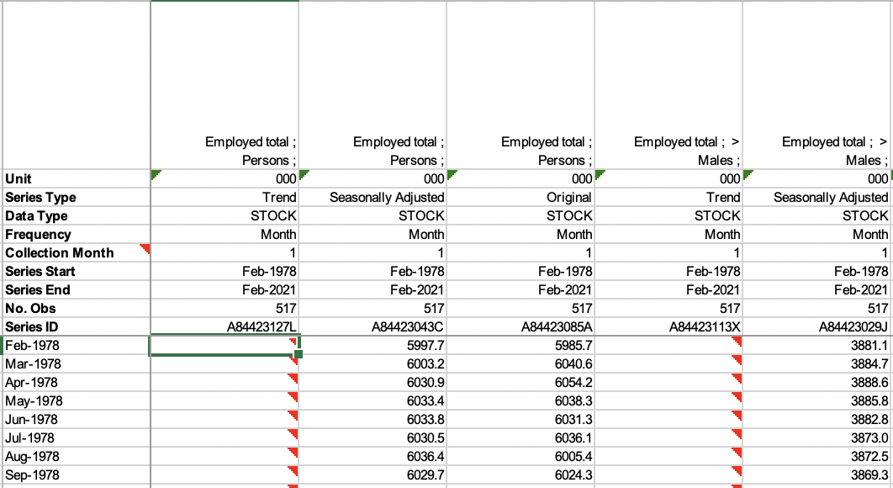

```{r setup, echo = FALSE, message = FALSE}
library(knitr)
knitr::opts_chunk$set(
  collapse = TRUE,
  comment = "#>",
  fig.path = "VIGNETTE-"
)

set.seed(42)
```

# About {readabs}

The `{readabs}` package helps you work with two types of data released by the Australian Bureau of Statistics: **time series spreadsheets** and **data cubes**.

All ABS time series spreadsheets look like this -- with the series in the first row, then 9 further rows of metadata, then the data. 

```{r out.width = "100%", echo = FALSE}

```

Data cubes can look like anything -- if it's not formatted like the screenshot above, it's a data cube.

This vignette provides information about how to use `{readabs}` to work with each of these data types.

# Working with ABS time series data

One key function -- `read_abs()` -- downloads, imports, and tidies ABS time series data.

## ABS time series data is messy

If you want to visualise or analyse data in R, you will often need to tidy it first. In [tidy data](http://vita.had.co.nz/papers/tidy-data.html):

1.  Each variable forms a column.
2.  Each observation forms a row.
3.  Each type of observational unit forms a table.

ABS time series data is not tidy. Tidying it requires a bit of work. This screenshot of an ABS time series spreadsheet shows some of the problems, namely:

-   metadata and data are in the same columns;
-   in some cases, the data are spread across multiple worksheets;
-   each time series has its own column (it's 'wide', not 'long'); and
-   dates are in an Excel format (eg. `Feb-1978` is stored as `28522`), which is a pain to convert to an actual date.

```{r out.width = "100%", echo = FALSE}
include_graphics("VIGNETTE-spreadsheet-screenshot.png")
```

## Download, import, and tidy time series data

`read_abs()` is the main function of the `{readabs}` package. First, let's load `{readabs}` and a couple of other packages we'll use for demonstration purposes:
```{r library, message=FALSE}
library(readabs)
library(dplyr)
library(ggplot2)
```

### Getting a whole catalogue number worth of time series data

If you give `read_abs()` an ABS catalogue number, it will download, import and tidy all the time series spreadsheets from that catalogue number. Easy!

For example, to get all the spreadsheets from the Wage Price Index, catalogue number 6345.0, we'd do:

```{r read-wpi-all, eval = FALSE}
wpi <- read_abs("6345.0")
```

```{r create-local-wpi, include=FALSE, eval=FALSE}
wpi <- read_abs("6345.0")
wpi <- head(wpi)
saveRDS(wpi, "wpi.rds")
```

```{r load-local-wpi, include = FALSE}
wpi <- readRDS("wpi.rds")
```

Cool! Now we've got a data frame (a tibble, to be precise) that contains all the time series from the Wage Price Index, converted to long and stacked on top of each other. Here's what it looks like:

```{r glimpse-wpi}
head(wpi)
```

It's over 54 000 rows long, and 12 variables wide. Some catalogue numbers are much bigger - for example, if you get the entire monthly Labour Force release (catalogue number 6202.0), you'll have a data frame with well over 2 million rows.

All the metadata from the time series spreadsheets is included in the data frame:

-   `table_title` is the title of the table;
-   `date` is the date of the observation in that row;
-   `series` is the name of the individual time series - in the ABS spreadsheet this is in the first row;
-   `value` is the observation, the actual data;
-   `series_type` can be 'Original', 'Seasonally Adjusted', or 'Trend';
-   `data_type` tells us whether this is an index number, a 'stock', a 'flow', expressed as a 'percent', etc.;
-   `collection_month` tells us (for quarterly or annual data) which month the data was collected;
-   `frequency` tells us the frequency of the time series;
-   `series_id` is a unique identifier given by the ABS to each time series; and
-   `unit` tells us the unit of measurement, such as '000s', 'Index Numbers', 'Percent' or '000 hours'.

The `table_no` and `sheet_no` columns will help you if you need to cross-check information on the ABS spreadsheet - `table_no` matches the filename of the spreadsheet (eg. '634501.xls') and `sheet_no` is the name of the Excel worksheet within the file that contains the time series.

### Get individual table(s)

Unless you tell it otherwise, `read_abs()` will get all the time series spreadsheets from a given catalogue number.

Generally this will be overkill. Maybe you don't want all ~2.1 million rows of Labour Force data; perhaps you know that the time series you need is in table 1. In that case you can use the `tables` argument to `read_abs()` to specify the table(s) you want:

```{r create-local-lfs, include=FALSE, eval=FALSE}
lfs_1 <- read_abs("6202.0", tables = 1)
lfs_1 <- head(lfs_1)
saveRDS(lfs_1, "lfs_1.rds")

lfs_5 <- read_abs("6202.0", tables = 5)
# lfs_5 <- head(lfs_5)
saveRDS(lfs_5, "lfs_5.rds")
```

```{r read-local-lfs_1, include=FALSE}
lfs_1 <- readRDS("lfs_1.rds")
```

```{r read-lfs-1, eval = FALSE}
lfs_1 <- read_abs("6202.0", tables = 1)
```

```{r glimpse_lfs_1}
head(lfs_1)
```

If you want more than one table, but not the whole catalogue number, you can specify multiple tables:

```{r read-local-lfs_1_t, include=FALSE}
lfs_5 <- readRDS("lfs_5.rds")
lfs_1_5 <- bind_rows(lfs_1, lfs_5)
```

```{r read-lfs-1-5, eval=FALSE}
lfs_1_5 <- read_abs("6202.0", tables = c(1, 5))
```

```{r glimpse_lfs_1_5}
head(lfs_1_5)
```

### Get time series using their IDs

Every ABS time series has a unique identifier. If you know the ID for the time series you need, you can supply it to the `series_id` argument to `read_abs()`. You can give it a single ID, or multiple IDs.

For example, the time series ID for the number of employed people in Australia (trend) is `"A84423127L"`. We can get a data frame that only contains that series as follows:

```{r create-local-seriesid, eval=FALSE, include=FALSE}
employed <- read_abs(series_id = "A84423127L")
employed <- head(employed)
saveRDS(employed, "employed.rds")
```

```{r read-local-seriesid, include = FALSE}
employed <- readRDS("employed.rds")
```

```{r read-abs-seriesid, eval = FALSE}
employed <- read_abs(series_id = "A84423127L")
```

```{r glimpse-seriesid}
head(employed)

unique(employed$series)
```

A benefit of this approach is that the filtering is done for you - the data frame only contains the series you're interested in. 

## Use `separate_series()` to work with your time series data

The `series` column of a table imported using `read_abs()` often contains a long, multi-part string, as this is how the ABS labels its series. This is where the `separate_series()` function comes in handy.

In this example, we'll work with data from the Labour Force survey that we downloaded and tidied earlier using `read_abs()`.

Now let's have a look at the time series from table 1 of the Labour Force survey:

```{r examine-lfs}
unique(lfs_1$series)
```

There's a bunch of data in here. We can see that the `series` column contains a first part, like "Participation rate" or "Unemployment rate", and a second part, which is "Persons", "Males", or "Females". You will often want to filter using one or both of these components separately - and sometimes there will be more than two components.

The `separate_series` function helps you by separating the `series` column into multiple components and removing extraneous symbols.

```{r separate-series}
lfs_1_sep <- lfs_1 %>%
  separate_series()

lfs_1_sep %>%
  group_by(series_1, series_2) %>%
  summarise()
```

The `remove_totals` and `remove_nas` arguments to `separate_series()` can be very useful when you are tidying data. They're both set to `FALSE` by default.

We've now got a new tibble that still contains the original `series` column, but also contains new columns `series_1` and `series_2`, with the two parts of `series` split into these new columns.

Let's make a data frame that just contains the male and female unemployment rates over time.

```{r create-unemp-df}
unemp <- lfs_1_sep %>%
  filter(series_1 == "Unemployment rate")

unique(unemp$series_1)

unique(unemp$series_2)
```

Now we have a data frame, `unemp`, that contains various unemployment rate series. Let's filter to only Males or Females.

```{r filter-male-female}
unemp <- unemp %>%
  filter(series_2 %in% c("Males", "Females"))

unique(unemp$series_2)
```

Now our data frame only contains the male and female unemployment rates, which is what we want. Let's graph it, filtering once more to show only the seasonally adjusted series and adding a 'sex' column:

```{r graph-unemp, dpi = 200}
unemp %>%
  filter(series_type == "Seasonally Adjusted") %>%
  mutate(sex = series_2) %>%
  ggplot(aes(x = date, y = value, col = sex)) +
  geom_line() +
  theme_minimal() +
  theme(
    legend.position = "bottom",
    axis.title = element_blank(),
    legend.title = element_blank(),
    text = element_text(size = 5)
  ) +
  labs(
    title = "The male and female unemployment rates have converged",
    subtitle = "Unemployment rates for Australian men and women (aged 15+), 1978-2018 (per cent)",
    caption = "Source: ABS 6202.0"
  )
```

Ta-da! Now we've got a nice little graph - and you didn't need to go to the ABS website or click around in Excel.


## Importing and tidying local time series spreadsheets

If you already have ABS time series spreadsheets saved locally that you want to read, the `read_abs_local()` function is what you want.

If you've downloaded files using `read_abs()`, you can import them using `read_abs_local()` by specifying the catalogue number. This will look in the subdirectory of `path` that corresponds to `cat_no`:

```{r read-lfs-local-catno, eval = FALSE}
lfs_local_1 <- read_abs_local("6202.0")
```

The data frame you'll get will look the same as if you'd used `read_abs()` to get the spreadsheet(s) from the ABS website.

# Working with ABS data cubes

All ABS time series spreadsheets are alike. Each ABS data cube is formatted in its own unique way.

There is no data cube equivalent of the `read_abs()` function that will download, import, and tidy any data cube for you. But `download_abs_data_cube()` can download any data cube, for you to then manually import and tidy. Use `show_available_catalogues()` to see all the 
possible catalogues, `search_catalogues()` to find catalogues that contain a given string (in the catalogue name itself, or the topic). Similarly, use `show_available_files()` to find all the filenames in a given catalogue, or `search_files()` to look for filenames within a catalogue that contain a particular string.

Convenience functions - `read_payrolls()` and `read_lfs_grossflows()` are included to download, import, and tidy particular commonly-used data cubes.

## Download data cubes

Any ABS data cube can be downloaded using the `download_abs_data_cube()` function. You need to specify the name of the catalogue (`catalogue_string`), and the filename (in whole or unique part) of the file you want to download (`cube`).

Let's say I want to download cube GM1, the gross flows spreadsheet from the monthly Labour Force release.

Let's look for the name of the catalogue:

```{r, eval = FALSE}
search_catalogues("labour force")
```
```{r, eval = FALSE, include = FALSE}
cats <- search_catalogues("labour force")
saveRDS(cats, "cats.rds")
```
```{r, echo = FALSE}
readRDS("cats.rds")
```

It looks like `labour-force-australia` is the catalogue name for the monthly Labour Force survey.

Now I need to find the filename for the gross flows spreadsheet, GM1.

```{r, eval = FALSE}
search_files("GM1", "labour-force-australia")
```
```{r, echo = FALSE}
x <- "GM1.xlsx"
x
```

The GM1 table is, conveniently enough, called `GM1.xlsx`. 

So we can download it like this:

```{r, eval=FALSE}
gm1_path <- download_abs_data_cube("labour-force-australia", "GM1")

print(gm1_path)
```
```{r, include=FALSE}
print("/var/folders/_4/ngvkm2811nbd8b_v66wytw1r0000gn/T//RtmpZT2ffU/GM1.xlsx")
```

Now we have an Excel sheet saved at that path, which you can import using `readxl::read_excel()` or the Excel-reading function of your choice.

## Download, import and tidy key data cubes
For most data cubes, you'll need to write your own code to import and tidy the data. But for some key cubes, convenience functions are provided.

### Labour force gross flows

The labour force gross flows cube is one of the cubes for which `readabs` includes a convenience function, `read_lfs_grossflows()`.

```{r, eval=FALSE, include=FALSE}
gf <- read_lfs_grossflows()
gf <- head(gf)
saveRDS(gf, "gf.rds")
```
```{r, include=FALSE}
gf <- readRDS("gf.rds")
```
```{r, eval=FALSE}
gf <- read_lfs_grossflows()
```

Now we have a tidy tibble of the Labour Force gross flows data:

```{r}
head(gf)
```

### ABS Weekly Payroll Jobs and Wages

The ABS Weekly Payroll Jobs and Wages release contains a range of useful information. Even though this release contains time series data, the ABS does not release it in its standard time series spreadsheet format, and `read_abs()` therefore cannot import it. The `read_payrolls()` function can be used instead.

Let's say you want to download the jobs figures, as index numbers, for each geographical area (SA3) over time. That's straightforward with `read_payrolls()`:

```{r, eval=FALSE, include=FALSE}
payrolls <- read_payrolls("sa3_jobs")
payrolls <- head(payrolls)
saveRDS(payrolls, "payrolls.rds")
```
```{r, include=FALSE}
payrolls <- readRDS("payrolls.rds")
```
```{r, eval=FALSE}
payrolls <- read_payrolls()
```

Here's what we've got:

```{r}
head(payrolls)
```


# Choosing where ABS data is saved

The `read_abs()` function downloads spreadsheets from the ABS website to your machine, then loads them into R, then tidies them.

By default, the spreadsheets will be saved in the directory specified by the environment variable `R_READABS_PATH`. If this variable isn't set, the spreadsheets are saved to a temporary directory. You can change this location for a specific instance by using the `path` argument to `read_abs()`.

Keeping the spreadsheets is often a good idea. But if you don't want to retain them, no problem. Just specify `retain_files = FALSE` when you use `read_abs()`. The spreadsheets will still be downloaded, but they'll be stored in a temporary directory that is flushed when your R session ends.
