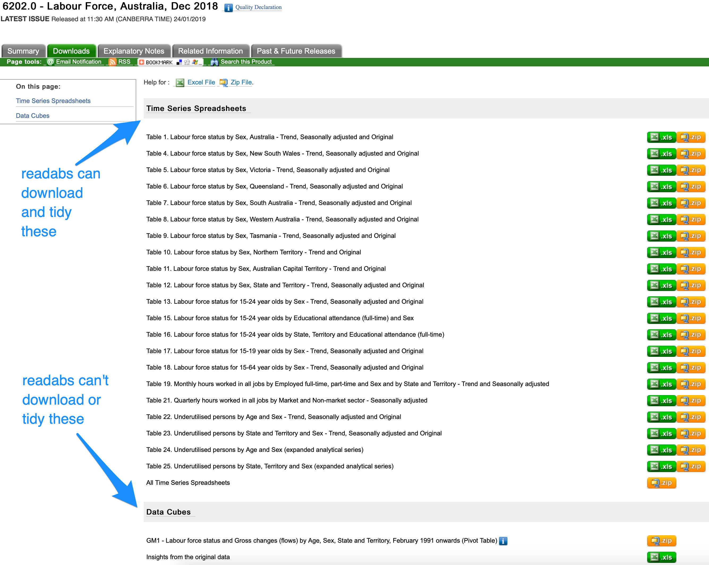

```{r setup, echo = FALSE, message = FALSE}
library(knitr)
knitr::opts_chunk$set(
  collapse = TRUE,
  comment = "#>",
  fig.path = "VIGNETTE-")

set.seed(42)

```

When working with time series data from the Australian Bureau of Statistics (ABS), you must:

1. Download the data; 
2. Read the data into R; and
3. Tidy the data.

The {readabs} package provides functions to help you with each of those steps. One key function  -- `read_abs()` -- streamlines the process for you.

The `separate_series()` function also helps with step three, tidying the data. You use it in conjunction with `read_abs()` - see the examples below.

Another function, `read_abs_local()` is useful if you have already downloaded ABS time series spreadsheet to disk; it imports and tidies the spreadsheets.

## The problem: ABS time series data is messy

If you want to visualise or analyse data in R, you will often need to tidy it first. In [tidy data](http://vita.had.co.nz/papers/tidy-data.html):

1. Each variable forms a column.
2. Each observation forms a row.
3. Each type of observational unit forms a table.

ABS time series data is not tidy. Tidying it requires a bit of work. This screenshot of an ABS time series spreadsheet shows some of the problems, namely:

* metadata and data are in the same columns;
* in some cases, the data are spread across multiple worksheets;
* each time series has its own column; and
* dates are in an Excel format (eg. Feb-1978 is stored as 28522), which is a pain to convert.

```{r out.width = "100%", echo = FALSE}
include_graphics("VIGNETTE-spreadsheet-screenshot.png")
```

{readabs} does a lot of the work of tidying these spreadsheets for you, so you can get to your analysis more quickly.

## The solution: `read_abs()`

```{r library}
library(readabs)
library(dplyr)
library(ggplot2)
```

### Getting a whole catalogue number worth of time series data

The main function in the package is `read_abs()`. If you give it an ABS catalogue number, it will download, import and tidy all the time series spreadsheets from that catalogue number. Easy!

For example, to get all the spreadsheets from the Wage Price Index, catalogue number 6345.0, we'd do:

```{r read-wpi-all, eval = FALSE}
wpi <- read_abs("6345.0")
```
```{r create-local-wpi, include=FALSE, eval=FALSE}
wpi <- read_abs("6345.0")
wpi <- head(wpi)
saveRDS(wpi, "wpi.rds")

```
```{r load-local-wpi, include = FALSE}
wpi <- readRDS("wpi.rds")

```

Cool! Now we've got a data frame (a tibble, to be precise) that contains all the time series from the Wage Price Index, converted to long and stacked on top of each other. Here's what it looks like:

```{r glimpse-wpi}

head(wpi)
```


It's over 54 000 rows long, and 12 variables wide. Some catalogue numbers are much bigger - for example, if you get the entire monthly Labour Force release (catalogue number 6202.0), you'll have a data frame with over 2.1 million rows.

All the metadata from the time series spreadsheets is included in the data frame:

* `table_title` is, as you'd expect, the title of the table;
* `date` is the date of the observation in that row;
* `series` is the name of the individual time series - in the ABS spreadsheet this is in the first row;
* `value` is the observation, the actual data;
* `series_type` can be 'Original', 'Seasonally Adjusted', or 'Trend';
* `data_type` tells us whether this is an index number, a 'stock', a 'flow', expressed as a 'percent', etc.;
* `collection_month` tells us (for quarterly or annual data) which month the data was collected;
* `frequency` tells us the frequency of the time series;
* `series_id` is a unique identifier given by the ABS to each time series; and
* `unit` tells us the unit of measurement, such as '000s', 'Index Numbers', 'Percent' or '000 hours'.

The `table_no` and `sheet_no` columns will help you if you need to cross-check information on the ABS spreadsheet  - `table_no` matches the filename of the spreadsheet (eg. '634501.xls') and `sheet_no` is the name of the Excel worksheet within the file that contains the time series.

### Get individual table(s)

Unless you tell it otherwise, `read_abs()` will get all the time series spreadsheets from a given catalogue number.

Generally this will be overkill. Maybe you don't want all 2.1 million rows of Labour Force data; perhaps you know that the time series you need is in table 1. In that case you can use the `tables` argument to `read_abs()` to specify the table(s) you want:
```{r create-local-lfs, include=FALSE, eval=FALSE}
lfs_1 <- read_abs("6202.0", tables = 1)
lfs_1 <- head(lfs_1)
saveRDS(lfs_1, "lfs_1.rds")

lfs_5 <- read_abs("6202.0", tables = 5)
lfs_5 <- head(lfs_5)
saveRDS(lfs_5, "lfs_5.rds")
```
```{r read-local-lfs_1, include=FALSE}
lfs_1 <- readRDS("lfs_1.rds")
```
```{r read-lfs-1, eval = FALSE}

lfs_1 <- read_abs("6202.0", tables = 1)
```
```{r glimpse_lfs_1}
head(lfs_1)

```

If you want more than one table, but not the whole catalogue number, you can specify multiple tables:

```{r read-local-lfs_1_t, include=FALSE}
lfs_5 <- readRDS("lfs_5.rds")
lfs_1_5 <- bind_rows(lfs_1, lfs_5)

```
```{r read-lfs-1-5, eval=FALSE}

lfs_1_5 <- read_abs("6202.0", tables = c(1, 5))
```
```{r glimpse_lfs_1_5}
head(lfs_1_5)

```

The `tables` argument can be either a numeric vector (eg. `c(1, 5)`) or a character vector (eg. `c("1", "5a")`).

## Use `separate_series()` to work with your data

The `read_abs()` function does a lot of the work for you by getting your data in a tidy (long) format. This makes it easier to filter to the data you're interested in and generate output (like graphs) using the [Tidyverse](https://www.tidyverse.org) packages, such as `dplyr` and `ggplot2`. You'll often want to do some further cleaning up of the data to make it easier to work with. This is where the `separate_series()` function comes in handy.

In this example, we'll work with data from the Labour Force survey that we downloaded and tidied earlier using `read_abs()`.

Now let's have a look at the time series from table 1 of the Labour Force survey:

```{r examine-lfs}
unique(lfs_1$series)
```

There's a bunch of data in here. We can see that the `series` column contains a first part, like "Participation rate" or "Unemployment rate", and a second part, which is "Persons", "Males", or "Females". You will often want to filter using one or both of these components separately - and sometimes there will be more than two components.

The `separate_series` function helps you by separating the `series` column into multiple components and removing extraneous symbols.

```{r separate-series}
lfs_1_sep <- lfs_1 %>%
  separate_series()

lfs_1_sep

```

The `remove_totals` and `remove_nas` arguments to `separate_series()` can be very useful when you are tidying data. They're both set to `FALSE` by default.

We've now got a new tibble that still contains the original `series` column, but also contains new columns `series_1` and `series_2`, with the two parts of `series` split into these new columns.

Let's make a data frame that just contains the male and female unemployment rates over time, using the seasonally adjusted time series.

```{r create-unemp-df}

unemp <- lfs_1_sep %>%
  filter(series_1 == "Unemployment rate")

unique(unemp$series_1)

unique(unemp$series_2)

```

Now we have a data frame, `unemp`, that contains various unemployment rate series. Let's filter to only Males or Females.

```{r filter-male-female}

unemp <- unemp %>%
  filter(series_2 %in% c("Males", "Females"))

unique(unemp$series_2)
```

Now our data frame only contains the male and female unemployment rates, which is what we want. Let's graph it, filtering once more to show only the seasonally adjusted series and adding a 'sex' column:

```{r graph-unemp, dpi = 200}

unemp %>%
  filter(series_type == "Seasonally Adjusted") %>%
  mutate(sex = series_2) %>%
  ggplot(aes(x = date, y = value, col = sex)) +
  geom_line() +
  theme_minimal() +
  theme(legend.position = "bottom",
        axis.title = element_blank(),
        legend.title = element_blank(),
        text = element_text(size = 5)) +
  labs(title = "The male and female unemployment rates have converged",
       subtitle = "Unemployment rates for Australian men and women (aged 15+), 1978-2018 (per cent)",
       caption = "Source: ABS 6202.0")
```

Ta-da! Now we've got a nice little ggplot2 graph - and you didn't need to go to the ABS website or click around in Excel.

## How to get time series using their unique ID(s)

Every ABS time series has a unique identifier. If you know the ID for the time series you need, you can supply it to the `series_id` argument to `read_abs()`. You can give it a single ID, or multiple IDs.

For example, the time series ID for the number of employed people in Australia (trend) is "A84423127L". We can get a data frame that only contains that series as follows:

```{r create-local-seriesid, eval=FALSE, include=FALSE}
employed <- read_abs(series_id = "A84423127L")
employed <- head(employed)
saveRDS(employed, "employed.rds")

```
```{r read-local-seriesid, include = FALSE}
employed <- readRDS("employed.rds")
```
```{r read-abs-seriesid, eval = FALSE}
employed <- read_abs(series_id = "A84423127L")
```
```{r glimpse-seriesid}
head(employed)

unique(employed$series)
```

A benefit of this approach is that the filtering is done for you - the data frame only contains the series you're interested in.

## {readabs} only works with time series

The spreadsheets on the ABS website are divided into one of two categories: **time series spreadsheets** and **data cubes**. For example, the main Labour Force release contains both:

```{r out.width = "100%", echo = FALSE}

```

The readabs package can download and tidy data contained in ABS time series spreadsheets. It can't download or tidy any spreadsheet the ABS describes as a 'data cube'.

## Why is my hard drive filling up with spreadsheets?

The `read_abs()` function downloads spreadsheets from the ABS website to your machine, then loads them into R, then tidies them.

By default, the spreadsheets will be saved in the directory specified by the environment variable `R_READABS_PATH` or, if it is unset, a temporary directory. You can change this location for a specific instance by using the `path` argument to `read_abs()`.

Keeping the spreadsheets is often a good idea. But if you don't want to retain them, no problem. Just specify `retain_files = FALSE` when you use `read_abs()`. The spreadsheets will still be downloaded, but they'll be stored in a temporary directory that is flushed when your R session ends.

## What if I've already downloaded spreadsheets?

If you already have ABS time series spreadsheets saved locally that you want to read, the `read_abs_local()` function is what you want.

If you just run `read_abs_local()` without any arguments specified, it will look in the directory given by the `R_READABS_PATH` environment variable (if set) and attempt to read any .xls files located there (note: it won't look in any of its subdirectories).

In this vignette, the location of the files we've downloaded so far depend on whether
you have this environment variable set. To demonstrate `read_abs_local()` we'll need
to know the path in order to demonstrate how to use `read_abs_local()`


```{r current_path}
current_path <- Sys.getenv("R_READABS_PATH")
if (!nzchar(current_path)) {
  current_path <- tempdir()
}
```

If you want to read all the files from a different directory, specify it using the `path` argument.

If you've downloaded files using `read_abs()`, you can import them using `read_abs_local()` by specifying the catalogue number. This will look in the subdirectory of `path` that corresponds to `cat_no`:

```{r read-lfs-local-catno, eval = FALSE}
lfs_local_1 <- read_abs_local("6202.0")
```

If you want to read a particular table, or tables, you can specify them using the `filenames` argument. If your files are not in
`Sys.getenv("R_READABS_PATH")` or if they are in a subdirectory of this path,
you'll need to specify the directory using `path`, like this:

```{r read-lfs-local, eval = FALSE}
lfs_local_2 <- read_abs_local(filenames = c("6202001.xls", "6202005.xls"),
                              path = file.path(current_path, "6202.0"))
```


The data frame you'll get will look the same as if you'd used `read_abs()` to get the spreadsheet(s) from the ABS website.
